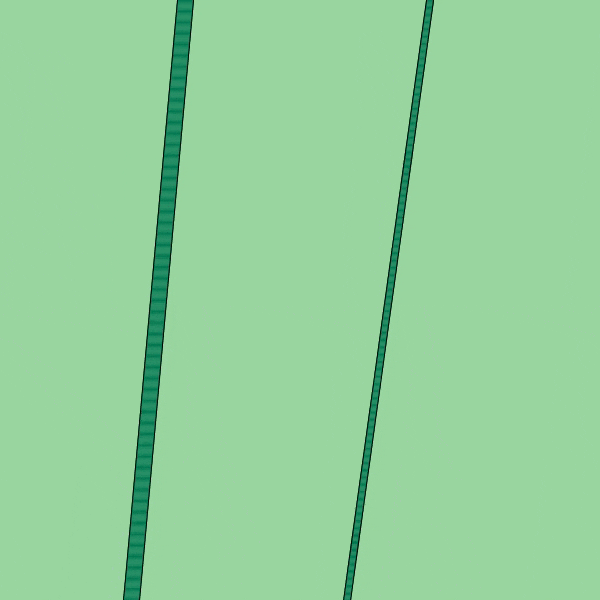
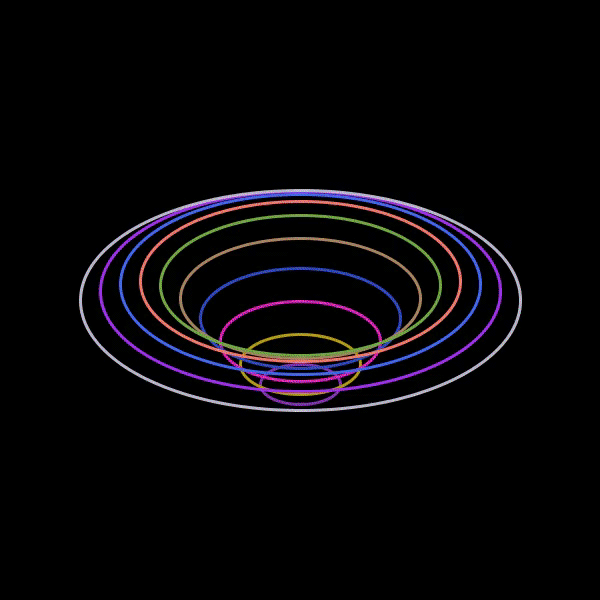

# Processing-Art
This is a gallery of all the things I've created so far in Processing. 

### 1. Star-like shape using polar co-ordinates

### 2. Grass animation

### 3. Ellipses moving like a slinky
This one is just 10 ellipses moving sinusoidally with the smallest one having the largest amplitude.
